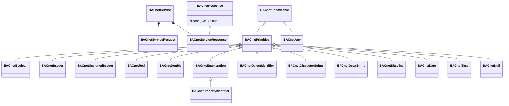

# openbac-bacnet
BACnet implementation for Java based on Netty network library

# Architecture

```mermaid
classDiagram
BACnetService *-- BACnetServiceRequest
BACnetService *-- BACnetServiceResponse
BACnetResponse <|-- BACnetServiceResponse
BACnetResponse : encode(ByteBuf buf)
BACnetEncodeable <|-- BACnetPrimitive
BACnetEncodeable <|-- BACnetAny
BACnetPrimitive <|-- BACnetBoolean
BACnetPrimitive <|-- BACnetInteger
BACnetPrimitive <|-- BACnetUnsignedInteger
BACnetPrimitive <|-- BACnetReal
BACnetPrimitive <|-- BACnetDouble
BACnetPrimitive <|-- BACnetEnumeration
BACnetPrimitive <|-- BACnetObjectIdentifier
BACnetPrimitive <|-- BACnetCharacterString
BACnetPrimitive <|-- BACnetOctetString
BACnetPrimitive <|-- BACnetBitstring
BACnetPrimitive <|-- BACnetDate
BACnetPrimitive <|-- BACnetTime
BACnetPrimitive <|-- BACnetNull
BACnetEnumeration <|-- BACnetPropertyIdentifier
```

