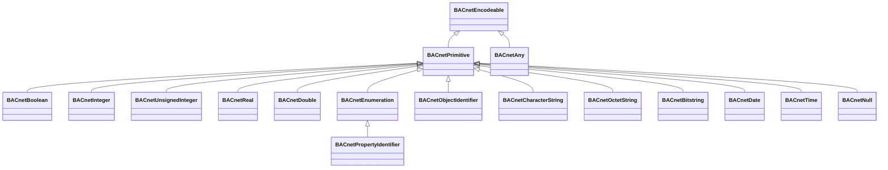

# openbac-bacnet
BACnet implementation for Java based on Netty network library

# About
This is a implementation of the BACnet/IP ASHRAE standard in Java.
It is far from complete and maybe never will be, it is mainly to evaluate implementation concepts.
The network layer is based on [netty](https://netty.io) to evaluate also asynchronous IO mechanisms.
It is currently based on Java 11 and may upgraded to a newer version, there is no special focus on things like
e.g. Android support (which may or may not be possible also)

#Model Based Software Engineering
Parts of the standard are represented as models (written in XML) and teh code is generated.
Since large parts of the standard are basically compositions of primitive Elements this
seems to be most flexible. In fact BACnet itself is specified as ASN.1 but somehow with custom encoding rules,
so that it is not possible to generate it completely from the ASN.1 model.

# Architecture

Implementation of services is along the pattern that a service class 
serves as abstraction of the service as API.
The communication part (a.k. messages) are composite classes within the service to 
have high coherence.

The datatype model starts with BACnet encodeable that encapsulates all functionality to 
de/encode a message into the bytestream.
BACnetEnumeration and BACnetBitstring are special, since the standard defines
a lot of enumerations which are generated of the model and are subclasses of the respective primitive type.

BACnetPrimitive serves as an intermediate to provide a factory for Primitive Datatypes

